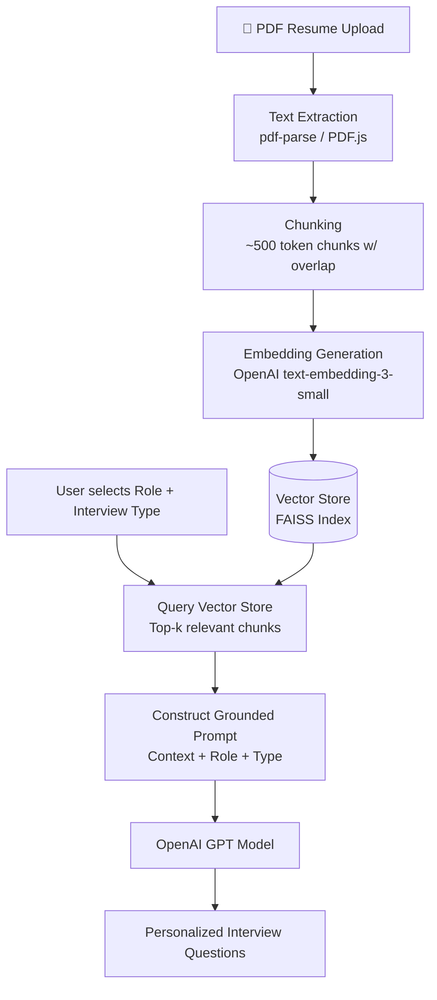

<div align="center">

<!-- BANNER -->
 

<!-- BADGES -->
<p>
  
  
  
  
</p>

<p>
  
  
  
</p>


</div>

---

## 📑 Table of Contents

- [Overview](#-overview)
- [Features](#-features)
- [Tech Stack](#-tech-stack)
- [How RAG Powers This App](#-how-rag-retrieval-augmented-generation-powers-this-app)
- [Folder Structure](#-folder-structure)
- [Installation](#️-installation)
- [Environment Variables](#-environment-variables)
- [API Routes](#-api-routes)
- [Database Models](#-database-models)
- [AI + RAG Workflow](#-ai--rag-workflow)
- [Payment Workflow](#-payment-workflow)
- [Screens](#-screens)
- [Future Improvements](#-future-improvements)
- [Learning Outcomes](#-learning-outcomes)
- [Author](#-author)
- [License](#-license)
- [Support](#-support)

---

## 📌 Overview

**MockMate AI** is a full-stack **MERN** application that simulates a real interview experience end-to-end.

Users can:

- 📄 Upload their resume (PDF)
- 🧠 Let the AI **read, chunk, and embed** their resume using a **RAG (Retrieval-Augmented Generation)** pipeline
- 🎯 Generate **personalized** AI interview questions grounded in their actual resume content
- 🎤 Practice **Technical** or **HR** interviews
- 📊 Receive instant **AI feedback** after every answer
- 📈 View interview scores and performance reports
- 💳 Purchase interview credits securely via **Stripe**

The goal of this project is to help candidates walk into real interviews more prepared, confident, and self-aware of their gaps.

---

## ✨ Features

### 🔐 Authentication
- User Registration & Login
- JWT Authentication
- Protected Routes

### 📄 Resume Analysis (RAG-Powered)
Users upload a resume in PDF format. Instead of a single blind prompt to an LLM, the resume is:
1. Parsed into raw text
2. Split into semantic chunks
3. Converted into vector embeddings
4. Stored in a vector index for **retrieval-augmented** question generation

The AI extracts and grounds its output in:
- Role & Seniority
- Experience
- Skills
- Projects

This retrieved context is then used to generate **highly personalized**, hallucination-resistant interview questions.

### 🤖 AI Question Generation
Questions are generated using **OpenAI GPT models**, augmented with retrieved resume context (RAG), based on:
- Resume content (retrieved chunks)
- Skills & Projects
- Experience level
- Selected Role
- Interview Type (Technical / HR)

### 🎤 AI Interview
- 5 AI-generated questions per session
- Timer for every question
- Answer submission
- Instant AI evaluation

### 📊 AI Feedback
Every answer is evaluated by OpenAI on:
- Confidence
- Communication
- Correctness (cross-checked against retrieved resume context)

The AI also provides:
- Final Score
- Short Feedback
- Full Performance Report

### 💳 Payment System
Users receive interview credits after purchasing plans securely via **Stripe Checkout**.

### 👤 User Dashboard
- Credits balance
- Interview History
- Previous Scores & Performance trends

### 📱 Responsive UI
Fully responsive across Desktop, Tablet, and Mobile.

---

## 🛠 Tech Stack

<div align="center">

| Layer | Technologies |
|---|---|
| **Frontend** |    React Router DOM · Axios · React Hot Toast · Lucide React |
| **Backend** |    Mongoose · JWT · Multer |
| **AI / RAG** |  OpenRouter API · `text-embedding-3-small` · FAISS (vector store) · PDF.js / `pdf-parse` for extraction · LangChain-style chunking |
| **Payments** |  |
| **Deployment** |  (Frontend) ·  (Backend) ·  |

</div>

---

## 🧠 How RAG (Retrieval-Augmented Generation) Powers This App

Rather than dumping an entire resume into a single prompt (which is costly, hallucination-prone, and truncates on long resumes), MockMate AI uses a proper **RAG pipeline**:



**Why RAG instead of a plain prompt?**
- ✅ Keeps prompts small & cost-efficient (only relevant chunks are sent)
- ✅ Reduces hallucination — questions are grounded in *actual* resume content
- ✅ Scales to long, multi-page resumes without truncation
- ✅ Makes answer evaluation more accurate, since feedback can cross-reference the same retrieved context

---

## 📂 Folder Structure

```
MockMate-AI
│
├── Frontend
│   ├── src
│   │   ├── components
│   │   ├── pages
│   │   ├── context
│   │   └── assets
│   ├── App.jsx
│   └── main.jsx
│
├── Backend
│   ├── controllers
│   ├── middleware
│   ├── model
│   ├── routes
│   ├── services
│   └── ai/
│   │   ├── generateQuestions.js
│   │   └── evaluateAnswer.js
│   ├── config
│   ├── utils
│   └── index.js
│
└── README.md
```

---

## ⚙️ Installation

### Clone Repository
```bash
git clone https://github.com/Satyam6201/mockmate-ai.git
cd mockmate-ai
```

### Frontend Setup
```bash
cd Frontend
npm install
npm run dev
```
Runs on → `http://localhost:5173`

### Backend Setup
```bash
cd Backend
npm install
npm run dev
```
Runs on → `http://localhost:8080`

---

## 🔑 Environment Variables

Create a `.env` file inside `Backend/`:

```env
PORT=8080

MONGODB_URI=your_mongodb_url

JWT_SECRET=your_jwt_secret

# AI / RAG
OPENAI_API_KEY=your_openai_key
OPENROUTER_API_KEY=your_openrouter_key
EMBEDDING_MODEL=text-embedding-3-small
VECTOR_STORE_PATH=./data/faiss_index

# Payments
STRIPE_WEBHOOK_SECRET=your_webhook_secret
STRIPE_SECRET_KEY=your_stripe_secret
STRIPE_MOCK=false
```

---

## 🔌 API Routes

### Authentication
```
POST   /api/auth/register
POST   /api/auth/login
GET    /api/auth/profile
```

### Resume (RAG)
```
POST   /api/interview/resume            # upload + extract + chunk + embed
GET    /api/interview/resume/status     # check embedding/indexing status
```

### Interview
```
POST   /api/interview/generate-questions   # RAG-grounded question generation
POST   /api/interview/submit-answer
POST   /api/interview/finish
```

### Payment
```
POST   /api/payment/create-checkout-session
POST   /api/payment/verify-session
POST   /api/payment/webhook
```

---

## 🗄 Database Models

**User**
- Name, Email, Password, Credits

**Interview**
- Role, Experience, Interview Mode
- Questions, Answers, Feedback
- Score, Status

**ResumeIndex** *(new — supports RAG)*
- `userId`
- `chunks[]` (text + metadata)
- `embeddingVectorRefs[]`
- `vectorStorePath`
- `lastIndexedAt`

**Payment**
- `userId`
- `planId`
- `amount`
- `credits`
- `stripeSessionId`
- `stripePaymentIntentId`
- `status`

---

## 🔄 AI + RAG Workflow

```
User Uploads Resume (PDF)
        │
        ▼
Extract Resume Text (pdf-parse)
        │
        ▼
Chunk Text (semantic, ~500 tokens)
        │
        ▼
Generate Embeddings (OpenAI)
        │
        ▼
Store in Vector Index (FAISS)
        │
        ▼
Retrieve Top-K Relevant Chunks (per role/type)
        │
        ▼
Construct Grounded Prompt → OpenAI GPT
        │
        ▼
Generate Interview Questions
        │
        ▼
User Answers → AI Evaluation (context-aware)
        │
        ▼
Performance Report
```

---

## 💳 Payment Workflow

```
User → Choose Credits → Stripe Checkout
      → Payment Success → Webhook & Verification
      → Credits Added → Interview Available
```

---

## 🚀 Future Improvements

- 🎥 Video Interview
- 🗣 Voice Recognition & Speech Analysis
- 🧑‍💻 AI Avatar Interviewer
- 🏢 Company-wise Interview Sets
- 💻 Coding Editor + Live Code Execution
- 🏆 Leaderboard
- 🌙 Dark Mode
- 📜 Certificate Generation
- 📧 Email Reports
- 🔍 Hybrid Search (keyword + vector) for resume retrieval

---

## 📚 Learning Outcomes

This project helped in learning:

- React.js · Express.js · MongoDB · JWT Authentication · REST APIs
- **AI Integration with OpenAI**
- **RAG (Retrieval-Augmented Generation) pipeline design**
- **Vector embeddings & vector search (FAISS)**
- Resume Parsing & PDF Processing
- Stripe Payment Integration
- Framer Motion · Tailwind CSS
- File Upload · Protected Routes · Performance Optimization

---

## 👤 Author

<div align="center">

### Satyam Kumar Mishra
**Full Stack MERN Developer**

[](https://github.com/Satyam6201)
[](https://satyam-devfolio.vercel.app/)
[](https://www.linkedin.com/in/satyam-kumar-mishra-dev)

</div>

---

## 📄 License

This project is developed for learning and portfolio purposes.
Feel free to use and improve it.

---

## ⭐ Support

If you found this project helpful, please give this repository a **⭐ on GitHub**.
It motivates me to build more open-source projects.

<div align="center">

</div>