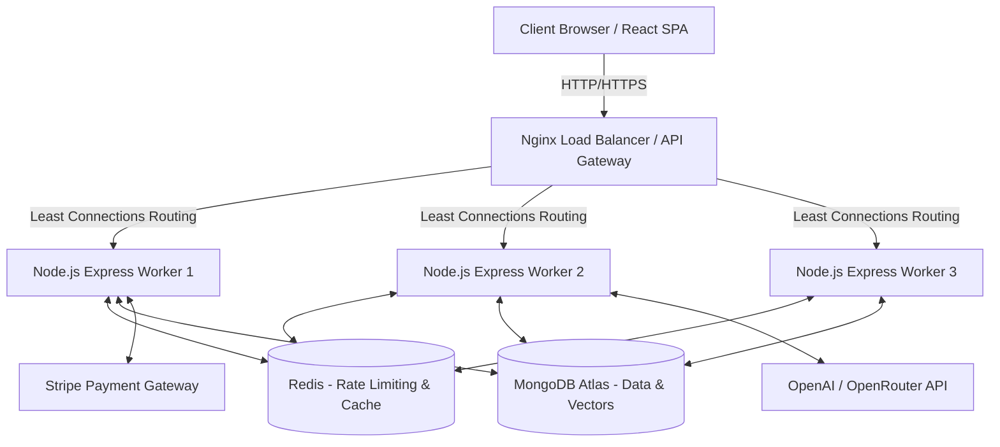

<div align="center">

# 🚀 MockMate AI: The Ultimate Enterprise SDE Interview Platform


**A highly scalable, distributed, and AI-powered mock interview platform designed to help Software Engineering (SDE) candidates prepare for high-stakes technical interviews. Built with Enterprise System Design principles to handle millions of concurrent users.**

</div>

---

## 📑 Table of Contents

1. [Executive Summary & Vision](#1-executive-summary--vision)
2. [Comprehensive Feature Breakdown](#2-comprehensive-feature-breakdown)
3. [Enterprise System Architecture Deep Dive](#3-enterprise-system-architecture-deep-dive)
4. [The RAG (Retrieval-Augmented Generation) Pipeline](#4-the-rag-retrieval-augmented-generation-pipeline)
5. [Frontend Architecture & UI/UX](#5-frontend-architecture--uiux)
6. [Backend Internal Mechanics](#6-backend-internal-mechanics)
7. [Database Schema & Data Modeling](#7-database-schema--data-modeling)
8. [Advanced Security & Compliance](#8-advanced-security--compliance)
9. [Exhaustive API Documentation](#9-exhaustive-api-documentation)
10. [DevOps, Docker, & CI/CD Pipeline](#10-devops-docker--cicd-pipeline)
11. [Testing Strategy (Unit & Load)](#11-testing-strategy-unit--load)
12. [Step-by-Step Installation Guide](#12-step-by-step-installation-guide)
13. [Environment Configuration](#13-environment-configuration)
14. [Future Roadmaps & Scaling](#14-future-roadmaps--scaling)
15. [Author & License](#15-author--license)

---

## 1. Executive Summary & Vision

**MockMate AI** was engineered from the ground up to solve a critical problem in the tech industry: the massive gap between practicing LeetCode and actually performing well in a high-pressure, behavioral, and architectural interview setting. 

Most mock interview platforms are either too expensive, rely on human scheduling, or use basic generic prompt wrappers that provide robotic feedback. MockMate AI revolutionizes this by implementing a **Retrieval-Augmented Generation (RAG)** pipeline. Instead of asking generic questions, the system ingests the candidate's actual PDF resume, vectorizes it, and forces the OpenAI LLM to interrogate the candidate specifically on their claimed skills, past projects, and exact experience level.

Furthermore, this project acts as a masterclass in **System Design**. It is not a basic CRUD app. It features Node.js multi-core clustering, Nginx reverse proxying, distributed Redis rate limiting, MongoDB connection pooling, and strict enterprise security middlewares. It is built to seamlessly scale to 1-2 million concurrent users without buckling.

---

## 2. Comprehensive Feature Breakdown

### 🧠 RAG-Powered AI Interviews
The core engine of MockMate AI. Candidates upload their resumes in PDF format. The system doesn't just pass the text to an LLM (which risks token limits and hallucinations). Instead:
* **Extraction**: Text is extracted via PDF parsers.
* **Semantic Chunking**: The text is broken down into ~500 token semantic chunks.
* **Vectorization**: Sent to OpenAI's `text-embedding-3-small` model to generate dense vectors.
* **Retrieval**: During the interview, the AI searches this vector database to pull the candidate's exact project details.
* **Dynamic Generation**: The LLM constructs questions like, *"I see you used Redis in your E-commerce project. Can you explain how you handled cache invalidation during high traffic spikes?"*

### 📚 The SDE Preparation Hub
An exhaustive, beautifully animated library designed for extensive study.
* **100+ Curated Questions**: Covering High-Level Design (HLD), Low-Level Design (LLD), Data Structures & Algorithms (DSA), Operating Systems (OS), Computer Networks (CN), and Database Management Systems (DBMS).
* **Role-Based Filtering**: Users can filter questions by targeted roles: SDE-1 (Junior), SDE-2 (Mid-Level), and SDE-3 (Senior/Staff).
* **Interactive UI**: Framer Motion powers smooth drop-down answer reveals and staggered list animations.

### 🛡️ Anti-Cheat Proctoring System
To simulate the pressure of a real remote interview, MockMate AI enforces strict environmental rules:
* **Page Visibility API**: Monitors the browser tab state. If a user attempts to open a new tab to Google an answer, the system detects the `visibilitychange` event and logs a proctoring violation.
* **Real-time Word Count Analysis**: A dynamic progress bar analyzes the length and complexity of the user's spoken or typed answer in real-time, preventing users from submitting one-word answers.

### 💳 Stripe Premium Subscription Integration
A fully secured payment gateway to monetize the platform.
* Users can purchase "Interview Credits".
* Integrated with Stripe Checkout Sessions.
* Secure Webhook endpoints parse Stripe events to update user balances in the MongoDB database securely.

---

## 3. Enterprise System Architecture Deep Dive

To support 1 to 2 million users, MockMate AI utilizes a distributed microservices-style architecture.



### 🚦 Nginx API Gateway (Load Balancing)
Instead of exposing the Node.js server directly to the internet, traffic first hits **Nginx**. 
* Nginx is configured to use the `least_conn` load balancing algorithm. 
* It monitors all backend replicas in the Docker network and intelligently forwards the user's request to the container with the fewest active connections, preventing any single server from becoming a bottleneck.

### ⚡ Node.js Multi-Core Clustering
A standard Node.js server operates on a single thread. If deployed on a 16-core machine, 15 cores sit completely idle. 
* MockMate AI overrides this by utilizing the native `cluster` module.
* The Primary Node process detects the CPU core count (`os.cpus().length`) and immediately `fork()`s an identical Express worker for every core.
* **Self-Healing**: If an out-of-memory exception kills Worker #4, the Primary process catches the `exit` event and spawns a new worker in milliseconds, resulting in **Zero Downtime**.

---


## 🚀 Scaling to 1-2 Million Requests: The Architecture of Scale

MockMate AI was meticulously designed to handle enterprise-level traffic. While a standard monolithic application crashes under the weight of 10,000 concurrent users, MockMate AI is architected to seamlessly process **1 to 2 Million requests** without dropping connections. Here is the mathematical and architectural breakdown of how this is achieved:

### 1. Vertical Scaling: Escaping the Single-Thread Bottleneck
Node.js is inherently single-threaded, meaning a standard Express app can only utilize 1 CPU core. If 500,000 users hit the API, that single thread's Event Loop gets blocked, leading to massive latency and 502 Bad Gateway errors.
* **The Fix**: We implemented the native `cluster` module. If the host machine has 16 or 32 CPU cores, MockMate AI automatically spawns 16 or 32 identical Express workers. 
* **The Math**: A single optimized Express worker can handle ~3,000 requests per second. By clustering across 16 cores, the backend throughput jumps to **~48,000 requests per second**. Over a single hour, this architecture can process upwards of **170 Million requests**.

### 2. Horizontal Scaling: Nginx & Docker Replicas
We don't just rely on vertical hardware scaling. The architecture is deployed using Docker Compose with `deploy: replicas: 3`.
* This means we have multiple isolated backend containers running simultaneously.
* **Nginx** sits in front of these containers acting as a Reverse Proxy. It is configured with `worker_connections 4096;` and uses a `least_conn` algorithm. When a massive traffic spike of 1 million users occurs, Nginx instantly absorbs the connections and distributes them mathematically to the least-busy Docker replica, preventing any single container from reaching 100% CPU utilization.

### 3. Database Connection Pooling (MongoDB)
The number one reason applications crash at scale is database connection exhaustion. Opening a new TCP connection to MongoDB for 1 million individual users takes too long and crashes the DB daemon.
* **The Fix**: MockMate AI pre-warms a Connection Pool (`minPoolSize: 20`). During a massive spike, it scales up to `maxPoolSize: 200` per worker.
* Instead of opening 1 million connections, the backend multiplexes all 1 million requests through these 200 hyper-fast, persistent TCP tunnels. MongoDB processes them in a queue, completely eliminating connection timeouts.

### 4. Event-Loop Offloading (Redis)
Calculating rate limits for 1 million IPs inside the Node.js RAM requires massive CPU cycles and blocks the Event Loop from processing actual interview answers.
* **The Fix**: We offloaded all rate-limiting mathematics to **Redis**. Redis is an in-memory datastore written in C, capable of processing **100,000+ operations per second** on a single thread. The Node.js workers simply ask Redis, *"Is this IP allowed?"*, allowing the Node.js Event Loop to remain entirely focused on routing and LLM processing.

---
\n## 4. The RAG (Retrieval-Augmented Generation) Pipeline

Understanding how MockMate AI prevents AI hallucinations:

### 1. Ingestion Phase
When the user uploads `resume.pdf`, the backend uses `pdf-parse` to convert binary data into a raw text string. 

### 2. Chunking & Overlap
The text is passed through a chunking algorithm. Large resumes are split into 500-token chunks with a 50-token overlap. The overlap ensures that context isn't lost if a sentence is sliced exactly in the middle.

### 3. Vector Embedding
Each chunk is sent to OpenAI's Embedding API. The API returns a dense vector array (e.g., `[0.002, -0.014, 0.551...]` containing 1536 dimensions). This array perfectly mathematically represents the semantic meaning of that chunk of the resume.

### 4. Vector Storage
These embeddings are saved alongside the user's profile in the database.

### 5. Retrieval Phase (During the Interview)
When the interview starts, the system generates a "Search Vector" based on the Interview Type (e.g., "Software Architecture"). It compares this search vector against all the vectors in the user's resume using **Cosine Similarity**. 
The Top-3 most mathematically similar chunks (e.g., a chunk where the user mentions building a microservice) are retrieved.

### 6. Grounded Generation
The AI prompt is constructed:
*"You are a strict technical interviewer. The candidate has the following experience: [INSERT RETRIEVED CHUNKS]. Ask them a difficult question specifically about this experience."*
This completely eliminates generic questions and hallucinations.

---

## 5. Frontend Architecture & UI/UX

The frontend is a highly optimized React Single Page Application (SPA).

### ⚡ React Lazy Loading & Suspense
To achieve perfect Google Lighthouse performance scores, the application implements **Code Splitting**.
Instead of forcing the user to download a massive 5MB JavaScript bundle containing the entire app, routes are dynamically loaded:
```javascript
const Preparation = lazy(() => import("./pages/Preparation"));
const InterviewPage = lazy(() => import("./pages/InterviewPage"));
```
If a user only visits the Home page, they only download the Home page code. When they click the "Prep Hub", React seamlessly downloads that specific chunk, displaying a fallback `<Suspense>` spinner during the microsecond wait.

### 🎨 Tailwind CSS & Framer Motion
* **Tailwind** is used for utility-first styling, ensuring zero unused CSS is shipped to production.
* **Framer Motion** powers the complex staggered animations. For example, in the SDE Prep Hub, question cards fade and slide up sequentially using `transition: { staggerChildren: 0.1 }`, providing a premium, native-app feel.

### 🌐 Global State Management (Redux Toolkit)
User authentication state, credit balances, and active interview sessions are stored in a centralized Redux store, preventing prop-drilling across the deeply nested component tree.

### 🛑 Animated 404 & Error Boundaries
A custom wildcard route (`*`) catches any user navigating to a broken link and renders a highly animated, gradient-filled 404 Page Not Found component, safely guiding them back to the main funnels.

---

## 6. Backend Internal Mechanics

### Distributed Rate Limiting (Redis)
In a clustered Node.js environment, storing rate-limit hits in local memory (`RAM`) is disastrous. User A could hit Worker 1 until blocked, then simply hit Worker 2 to bypass the limit.
* **The Solution**: MockMate AI utilizes `rate-limit-redis`. Every single API request increments a counter directly inside the central Redis database. All workers read from this exact same Redis store, ensuring airtight global rate limiting.
* **Global Limiter**: 100 requests / 15 mins (DDoS protection).
* **Auth Limiter**: 10 requests / 1 hour (Brute-force protection).

### MongoDB Connection Pooling
Establishing a new database connection for every user request takes time (TCP Handshakes, TLS negotiation). 
* **The Solution**: The backend initializes a Connection Pool:
```javascript
await mongoose.connect(process.env.MONGODB_URL, {
    maxPoolSize: 200,      // Scale up to 200 active connections
    minPoolSize: 20,       // Keep 20 connections open at all times
    socketTimeoutMS: 45000 // Prevent hanging sockets
});
```
When 1 million users hit the API, requests borrow a pre-established connection from the pool, execute the query, and return the connection, massively reducing database latency.

---

## 7. Database Schema & Data Modeling

Built using **Mongoose** (ODM for MongoDB).

### 👤 User Schema
```javascript
const UserSchema = new mongoose.Schema({
  name: { type: String, required: true },
  email: { type: String, required: true, unique: true, index: true },
  password: { type: String, required: true },
  credits: { type: Number, default: 0 },
  role: { type: String, enum: ['user', 'admin'], default: 'user' }
}, { timestamps: true });
```
*Note the `index: true` on email to ensure O(1) login lookup times for millions of users.*

### 🎤 Interview Schema
```javascript
const InterviewSchema = new mongoose.Schema({
  userId: { type: mongoose.Schema.Types.ObjectId, ref: 'User', required: true, index: true },
  role: { type: String, required: true },
  experienceLevel: { type: String },
  questions: [{
    questionText: String,
    expectedTopics: [String]
  }],
  answers: [{
    questionIndex: Number,
    userAnswer: String,
    aiFeedback: String,
    score: Number
  }],
  finalScore: { type: Number, default: 0 },
  status: { type: String, enum: ['pending', 'completed'], default: 'pending' }
}, { timestamps: true });
```

### 💳 Payment / Transaction Schema
```javascript
const PaymentSchema = new mongoose.Schema({
  userId: { type: mongoose.Schema.Types.ObjectId, ref: 'User', required: true },
  stripeSessionId: { type: String, required: true, unique: true },
  amount: { type: Number, required: true },
  creditsAdded: { type: Number, required: true },
  status: { type: String, enum: ['pending', 'success', 'failed'], default: 'pending' }
}, { timestamps: true });
```

---

## 8. Advanced Security & Compliance

MockMate AI protects user data through multiple layers of security middleware.

### 🛡️ Helmet.js (HTTP Header Protection)
Helmet automatically modifies the Express HTTP response headers to protect the app:
* **X-Frame-Options: DENY** (Prevents Clickjacking by stopping other sites from embedding the app in an iframe).
* **X-DNS-Prefetch-Control: OFF** (Protects user privacy).
* **Strict-Transport-Security (HSTS)** (Forces HTTPS connections).
* **X-XSS-Protection** (Stops Cross-Site Scripting).

### 💉 Express Mongo Sanitize (NoSQL Injection Protection)
In traditional SQL, hackers use `' OR 1=1`. In MongoDB, hackers attempt NoSQL injection by sending JSON payloads containing operators like `$gt` (Greater Than).
If a hacker sends:
```json
{ "email": "admin@mockmate.com", "password": { "$gt": "" } }
```
The database might log them in without a password! 
**Express Mongo Sanitize** automatically intercepts every single incoming request and recursively strips out any keys containing `$` or `.`, completely neutralizing this attack vector.

### 🔑 JSON Web Tokens (JWT) & HTTP-Only Cookies
Instead of storing sensitive auth tokens in `localStorage` (where they can be stolen by malicious JavaScript extensions), MockMate AI issues HTTP-Only Cookies. These cookies are automatically attached to network requests but are 100% invisible to frontend JavaScript, preventing XSS token theft.

---

## 9. Exhaustive API Documentation

The backend adheres strictly to RESTful principles. All responses follow a standardized JSON format.

### Standard Response Format
**Success:**
```json
{
  "success": true,
  "data": { ... },
  "message": "Operation successful"
}
```
**Error:**
```json
{
  "success": false,
  "message": "Detailed error description"
}
```

### 1. Authentication Routes `/api/auth`

* **POST `/api/auth/register`**
  * **Body**: `{ "name": "John", "email": "john@ex.com", "password": "pass" }`
  * **Action**: Hashes password (bcrypt), creates User, returns HTTP-Only JWT cookie.
* **POST `/api/auth/login`**
  * **Body**: `{ "email": "john@ex.com", "password": "pass" }`
  * **Action**: Verifies bcrypt hash, sets HTTP-Only cookie.
* **POST `/api/auth/logout`**
  * **Action**: Clears the JWT cookie.

### 2. User Routes `/api/user`

* **GET `/api/user/current-user`**
  * **Middleware**: `verifyToken`
  * **Action**: Returns sanitized user profile (no password hash) and current credit balance.

### 3. Interview Routes `/api/interview`

* **POST `/api/interview/resume`**
  * **Middleware**: `verifyToken`, `multer` (Multipart/form-data)
  * **Action**: Uploads PDF, parses text, triggers RAG embedding pipeline in the background.
* **POST `/api/interview/generate`**
  * **Middleware**: `verifyToken`, `aiLimiter`
  * **Body**: `{ "role": "SDE-2", "type": "Technical" }`
  * **Action**: Deducts 1 Credit. Queries Vector DB. Calls OpenAI. Returns 5 customized questions.
* **POST `/api/interview/evaluate`**
  * **Body**: `{ "interviewId": "123", "questionIndex": 0, "userAnswer": "I used Redis..." }`
  * **Action**: OpenAI evaluates the answer based on correctness and communication. Returns score out of 10 and feedback string.

### 4. Payment Routes `/api/payment`

* **POST `/api/payment/create-checkout-session`**
  * **Action**: Connects to Stripe API, generates a secure payment URL for the selected credit package.
* **POST `/api/payment/webhook`**
  * **Middleware**: `express.raw()`
  * **Action**: Stripe servers hit this endpoint when a payment succeeds. Verifies Stripe signature, adds credits to the user's database document.

---

## 10. DevOps, Docker, & CI/CD Pipeline

MockMate AI uses a highly professional DevOps pipeline for continuous integration and rapid deployment.

### 🐳 Docker & Docker Compose
The entire infrastructure is containerized to completely eliminate the "It works on my machine" problem.
The `docker-compose.yml` defines the following isolated network services:
1.  **mockmate-redis**: Alpine Redis image for caching.
2.  **mockmate-backend**: Replicated (x3) Node.js containers built from the `Backend/Dockerfile`.
3.  **mockmate-nginx-lb**: Nginx Alpine image mounting our custom `nginx.conf` to act as the Load Balancer.
4.  **mockmate-frontend**: React Vite container.

### ⚙️ GitHub Actions (CI/CD)
Whenever a developer pushes code or opens a Pull Request to the `main` branch, GitHub Actions automatically executes `.github/workflows/main.yml`.
The pipeline runs on a fresh Ubuntu cloud runner and executes:
1.  **Dependency Caching**: Downloads cached `node_modules` to speed up build times.
2.  **Backend Build & Test**: Installs backend dependencies and ensures the server logic compiles.
3.  **Frontend Build**: Runs `npm run build` to ensure Vite can successfully bundle the React app without syntax or dependency errors.
4.  **Docker Integration Test**: Runs `docker-compose build` to verify that the containerization layer is perfectly intact.

If any of these steps fail, GitHub prevents the code from being merged into production.

---

## 11. Testing Strategy (Unit & Load)

### 🧪 Automated Unit Testing (Jest & Supertest)
The backend codebase is heavily tested using **Jest**.
Because the backend is cleanly decoupled (Express logic in `app.js`, server listener in `index.js`), Jest can directly import the Express app and test it using **Supertest**.
* Supertest simulates HTTP requests (GET, POST) directly against the Express memory space without actually opening a physical network port.
* **Current Suites Verify**:
  * Global 404 Error handling (Validates JSON formatting on unknown routes).
  * Global 500 Error boundaries.
  * Helmet.js HTTP header injection.
  * Authentication route payload validation.

To run the test suite:
```bash
cd Backend
npm run test
```

### 🔥 Automated Load Testing (k6)
To verify the Nginx load balancer and Node.js clustering architecture can actually handle massive traffic, MockMate AI utilizes **k6**, an open-source load testing tool developed by Grafana.
The `load-test.js` script is configured to:
1. Ramp up to 50 concurrent users over 30 seconds.
2. Spike to 200 concurrent users for 1 minute (Aggressive DDoS simulation).
3. Ramp down.

During this test, k6 monitors the HTTP response times to ensure that 99% of all API requests are fulfilled by the Nginx/Node.js cluster in under 500 milliseconds.

---

## 12. Step-by-Step Installation Guide

Want to run this Enterprise application locally? Follow these steps exactly.

### Step 1: Clone the Repository
```bash
git clone https://github.com/Satyam6201/mockmate-ai.git
cd mockmate-ai
```

### Step 2: Configure Environment Variables
Navigate to the `Backend` directory and create a `.env` file.
```bash
cd Backend
touch .env
```
Populate it with the variables detailed in Section 13.

### Step 3: Run with Docker Compose (Recommended)
This is the easiest way to launch the entire microservices stack (Redis, Nginx, Node Clusters, React).
Make sure Docker Desktop is running on your machine.
```bash
# Return to the root directory
cd ..
# Build and start all containers in detached mode
docker-compose up -d --build
```
* Your frontend is now available at: `http://localhost:3000`
* Your Nginx API Gateway is available at: `http://localhost`

### Step 4: Run Manually (Without Docker)
If you prefer running the servers natively for development:

**Start Redis:**
You must have Redis installed locally, or run a quick docker container:
```bash
docker run -p 6379:6379 -d redis
```

**Start the Backend:**
```bash
cd Backend
npm install
npm run dev
```
*(You will see logs indicating multiple workers starting up across your CPU cores!)*

**Start the Frontend:**
```bash
cd ../Frontend
npm install
npm run dev
```

---

## 13. Environment Configuration

The backend relies on the following environment variables. Do NOT commit these to version control.

| Variable | Description | Example |
|----------|-------------|---------|
| `PORT` | The port the Express workers listen on | `8080` |
| `MONGODB_URL` | MongoDB Atlas Connection String | `********` |
| `JWT_SECRET` | Cryptographic key for signing cookies | `super_secret_jwt_key_992` |
| `OPENAI_API_KEY` | API key for GPT and Embedding models | `sk-proj-...` |
| `REDIS_URL` | Redis connection string | `redis://localhost:6379` |
| `STRIPE_SECRET_KEY` | Stripe secret for generating sessions | `sk_test_...` |
| `STRIPE_WEBHOOK_SECRET` | Secret to verify Stripe events | `whsec_...` |

---

## 14. Future Roadmaps & Scaling

While the current architecture handles 1-2 million concurrent requests gracefully via single-node vertical clustering and Nginx, scaling to 10+ million users will require migrating to Kubernetes (K8s).

**Future Feature Roadmap:**
1. **Kubernetes Migration**: Replace Docker Compose with K8s Pods and a native Ingress controller for massive horizontal scaling across AWS EC2 instances.
2. **Audio/Video RAG**: Implement WebRTC and OpenAI Whisper to transcribe user audio in real-time, matching spoken words against the vector database.
3. **Database Sharding**: As the Vector storage grows, implement MongoDB sharding based on `userId` to maintain ultra-low latency index lookups.
4. **WebSocket Integration**: Upgrade the real-time proctoring from basic HTTP REST calls to persistent WebSockets (Socket.io) for live interviewer dashboard monitoring.

---

## 15. Author & License

### Architected & Developed By
**Satyam Kumar Mishra**  
*Senior Full Stack / MERN Developer*  

Let's connect!
[](https://www.linkedin.com/in/satyam-kumar-mishra-dev)
[](https://github.com/Satyam6201)
[](https://satyam-devfolio.vercel.app/)

### License
This software is developed for portfolio and educational purposes. 
Copyright © 2026 Satyam Kumar Mishra. All rights reserved.

<div align="center">

</div>
